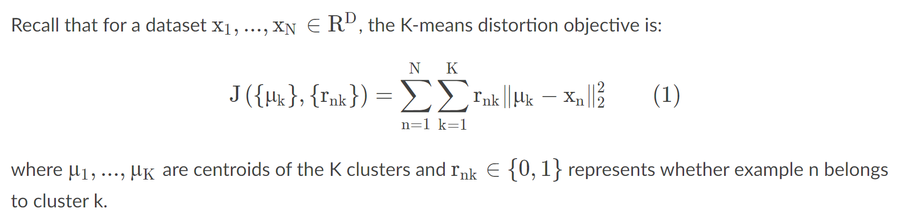
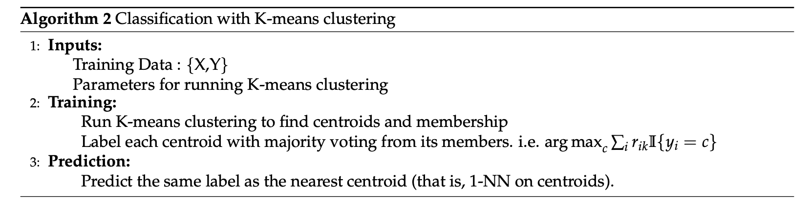
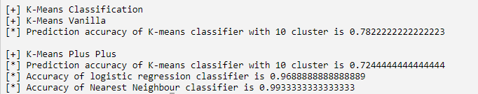

K-means Clustering
==============================

General instructions
--------------------

-   In this task you will implement the **K-means** algorithm and its
    applications.

High Level Description
----------------------

In this assignment you are asked to implement:

-   the K-means++ initialization,
-   the standard K-means algorithm given the initialization,
-   the nearest neighbor algorithm using the K-means centroids,
-   image compression via the K-means algorithm.

NOTE: Depending on your environment you may need to install the python
library named \"pillow\", which is used by matplotlib to process some of
the images needed for this assignment. You can install it by running
\"pip3 install pillow\" in your command line.

Q1. K-means++ initialization
----------------------------

K-means++ generally performs much better than the vanilla K-means
algorithm. The only difference is in the initialization of the
centroids. According to the discussions in the lecture, implement this
initialization in function `get_k_means_plus_plus_center_indices`. (Note
that we also provide the vanilla initialization method in
`get_lloyd_k_means`.)

Q2. K-means algorithm
---------------------

\
In this part, you need to implement the K-means procedure that
iteratively computes the new cluster centroids and assigns data points
to the new clusters. The procedure stops whenever 1) the number of
updates has reached the given maximum number, or 2) when the \*average\*
K-means distortion objective J changes less than a given threshold
between two iterations.\
\
Implement this part in the `fit`function of the class `KMeans`. While
assigning a sample to a cluster, if there is a tie (i.e. the sample is
equidistant from two or more centroids), you should choose the one with
the smaller index (which is what numpy.argmin does already).

After you complete the implementation, run `KmeansTest.py` to see the
results of this on a toy dataset. You should be able to see three images
generated in a folder called plots. In particular, you can see
`toy_dataset_predicted_labels.png` and `toy_dataset_real_labels.png`,
and compare the clusters identified by the algorithm against the real
clusters. Your implementation should be able to recover the correct
clusters sufficiently well. Representative images are shown below. Red
dots are cluster centroids. Note that color coding of recovered clusters
may not match that of correct clusters. This is due to mis-match in
ordering the retrieved clusters and the correct clusters (which is
fine).

Q3 Classification with K-means
------------------------------

Another application of clustering is to obtain a faster version of the
nearest neighbor algorithm. Recall that nearest neighbor evaluates the
distance of a test sample from every training point to predict its
label, which can be very slow. Instead, we can compress the entire
training dataset to just K centroids, where each centroid is now labeled
as the majority class of the corresponding cluster. After this
compression the prediction time of nearest neighbor is reduced from O(N)
to just O(K) (see below for the pseudocode).\
\
\
\
You need to complete the `fit` and `predict` function in
`KMeansClassifier` following the comments in the code. Again, whenever
you need to break a tie, pick the one with the smallest index.\
\
Once completed, run `KmeansTest.py` again to evaluate the classifier on
a test set (digits). For comparison, the script will also print accuracy
of a logistic classifier and a vanilla nearest neighbor classifier. An
example is shown below. 

Q4 Image compression with K-means
---------------------------------

In this part, we will take lossy image compression as another
application of clustering. The idea is simply to treat each pixel of an
image as a point, then perform K-means algorithm to cluster these
points, and finally replace each pixel with its closest centroid.\

What you need to implement is to compress an image with K centroids
given (called code\_vectors). Specifically, complete the function
`transform_image` following the comments in the code.\
\
After your implementation, run `KmeansTest.py` again. You should be able
to see an image `compressed_baboon.png` in the plots folder. You can see
that this image is slightly distorted as compared to the original
baboon.tiff. The ideal result should take about 35-40 iterations and the
Mean Square Error (between the two images) should be less than 0.0098.
It takes about 1-2 minutes to complete normally.
