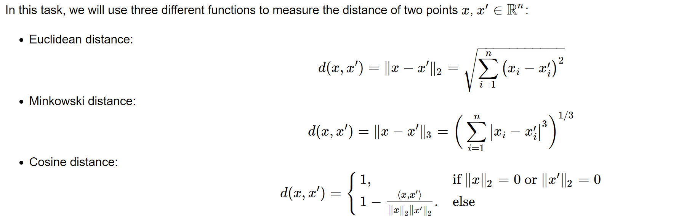
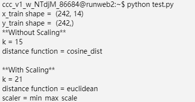

K-Nearest Neighbours for Binary Classification
=================================================================================

General instructions
----------------------------------------------------

-   In this task you will implement the **K-Nearest Neighbours**
    algorithm.

Background
----------------------------------------

To measure the performance of the algorithm, we will use a widely-used
metric called **F1-score** (instead of the \"error rate\" discussed in
the class). You need to self-learn the formula of F1-score from
[wikipedia](https://en.wikipedia.org/wiki/F1_score). Note that in this
task, a \"positive\" sample is labeled as \"1\", and a \"negative\" one
is labeled as \"0\".

### Part 1.1 F1 score and distance functions

Follow the notes from Background and implement the following items in
*util.py*

    - f1_score
    - class Distance
        - euclidean_distance
        - minkowski_distance
        - cosine_similarity_distance

### Part 1.2 KNN class

Based on what we discussed in the lecture as well as the comments in the
code, implement the following items in *knn.py*

    - class KNN
        - train
        - get_k_neighbors
        - predict

### Part 1.3 Data transformation

We are going to add one more step (data transformation) in the data
processing part and see how it works. Sometimes, normalization plays an
important role to make a machine learning model work. This link might be
helpful <https://en.wikipedia.org/wiki/Feature_scaling>. Here, we take
two different data transformation approaches.

#### Normalizing the feature vector

If a vector is an all-zero vector, we let the normalized vector to be itself.

#### Min-max scaling for each feature

The above normalization is independent of the rest of the data. On the
other hand, **min-max normalization** scales each sample in a way that
depends on the rest of the data. More specifically, for each feature, we
normalize it linearly so that its value are between 0 and 1 across all
samples, and in addition, the largest value becomes exactly 1 while the
smallest becomes exactly 0. For more information and examples, read the
comments in the code.

You need to implement the following items in *util.py*:

    - class NormalizationScaler
        - __call__
    - class MinMaxScaler    
        - __call__

### Part 1.4 Hyperparameter tuning

Hyperparameter tuning is an important step for building machine learning
models. Here, we can treat the value of k, the distance function, and
the data transformation schemes as the hyperparameters of the KNN
algorithm. You need to try different combinations of these parameters
and find the best model with the highest F1 score. Following the
concrete comments in the code and implement the following functions in
*util.py*:

    - class HyperparameterTuner
        - tuning_without_scaling
        - tuning_with_scaling

### Part 1.5 Testing with *test.py*

There is nothing to implement in this part, but you can make use of the
*test.py* file to debug your code and make sure that your implementation
is correct. After you have completed all the classes and functions
mentioned above, test.py file should run smoothly and show the following
if your implementation is correct:

You can also uncomment Line 16 of *data.py*: np.random.shuffle(white),
to shuffle the data and further test your code.
