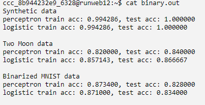
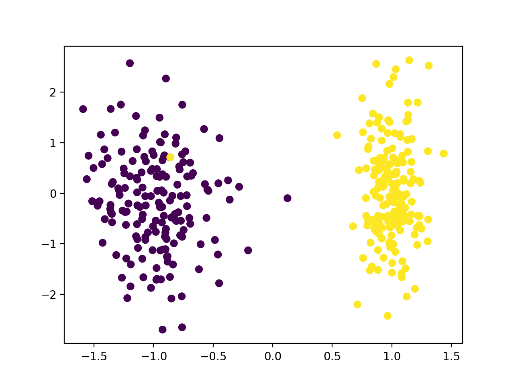
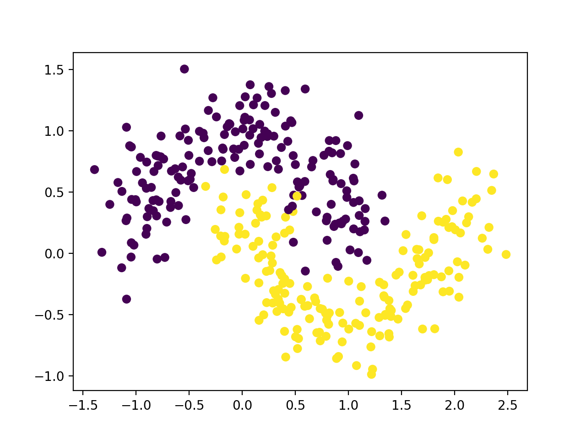
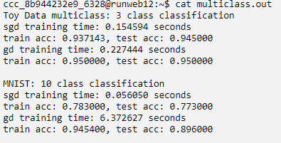

Linear Classifiers (60 points)
===================================================================

General instructions
----------------------------------------------------

-   In this task you will implement **linear classifiers** by minimizing
    perceptron loss or logistic loss.

### Part 1. Binary Classification - Perceptron vs. Logistic

In this part you are given a training set for a binary classification
problem, and your task is to train a linear classifier. To test if you
truly understand the algorithms discussed in the class, we intensionally
introduce some extra complexity: first, the labels are either 0 or 1,
instead of -1 or +1; second, the features do not contain the constant
value 1, and you do need to explicitly learn a bias term (in other
words, you are trying to learn a model \$ w\^\\top x + b \$, instead of
just \$w\^\\top x\$). These extra complications are often met in
practice, and you need to think carefully before applying the formulas
from the lectures.

-   `TODO 1` In function `binary_train`, implement Gradient Descent to
    minimize the \*average\* perceptron loss defined in terms of the
    given training set. You are given the initial parameters, the step
    size, and the number of iterations needed.
-   `TODO 2` In function `binary_train`, implement Gradient Descent to
    minimize the \*average\* logistic loss defined in terms of the given
    training set. Again, you are given the initial parameters, the step
    size, and the number of iterations needed. It will be convenient to
    implement the sigmoid function `sigmoid` for this part, so please do
    so in `TODO 3`.
-   `TODO 4` In function `binary_predict`, implement the prediction of a
    given linear model on a given test set. Note that your prediction
    should be deterministic (that is, do not randomize).

After you finish this part, you can run `binary.sh` to test your code,
which produces a file `binary.out`. If your code is programmed
correctly, you should see something similar to the below (it is okay if
the numbers are not exactly the same but close enough).

Below is the visualization of the first two datasets:

-   Synthetic data: 
-   Two Moon data: 

### Part 2. Multiclass classification - SGD vs. GD

Next, you need to implement multinomial logistic regression with either
Gradient Descent or Stochastic Gradient Descent for a multiclass
classification problem. Again, please note the following: first, the
labels are indexed by \$0, 1, \\ldots, C-1\$; second, you need to
explicitly learn the bias vector.

In addition, please follow the following tip when implementing the
softmax function (an essential part of the algorithm), to avoid
numerical issues such as overflow and underflow caused by `np.exp`.
Suppose the original input vector to the softmax function is \$z\$. In
the actual implementation, use vector \$\\tilde{z} = z - \\max(z)\$ as
the input of the softmax function instead. That is, if you want to
compute \$\\frac{\\exp(z\_{i})}{\\sum\_{j=1}\^{D}\\exp(z\_{j})}\$,
compute
\$\\frac{\\exp(\\tilde{z}\_{i})}{\\sum\_{j=1}\^{D}\\exp(\\tilde{z}\_{j})}\$
instead, which is clearly mathematically equivalent but numerically more
stable.

-   `TODO 5` In function `multiclass_train`, implement Stochastic
    Gradient Descent to minimize the \*average\* multiclass logistic
    loss defined in terms of the given training set. You are given the
    initial parameters, the step size, and the number of iterations
    needed. Moreover, in each iteration of SGD, we have already randomly
    selected a sample for you (indexed by \$n\$). Please do not modify
    this part or the random seed in your final submission (you can of
    course change it when debugging your code if needed).
-   `TODO 6` In function `multiclass_train`, implement Gradient Descent
    to minimize the \*average\* multiclass logistic loss defined in
    terms of the given training set. Again, you are given the initial
    parameters, the step size, and the number of iterations needed. Try
    to use matrix calculation provided in the numpy package instead of
    nested for loops in your implementation, which great reduces the
    running time.
-   `TODO 7` In function `multiclass_predict`, implement the prediction
    of a given linear model on a given test set. Again, your prediction
    should be deterministic (that is, do not randomize).

After you complete this part, run `multiclass.sh` to test your code,
which produces a file `multiclass.out`. If your code is programmed
correctly, you should see something similar to the below (it is okay if
the numbers are not exactly the same but close enough).
{width="400"}

Below is the visualization of the first toy dataset:
