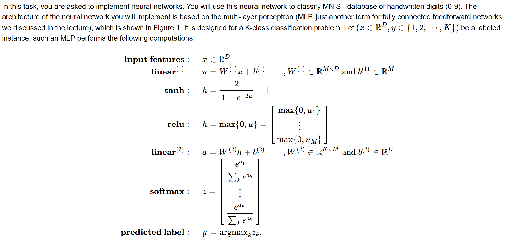
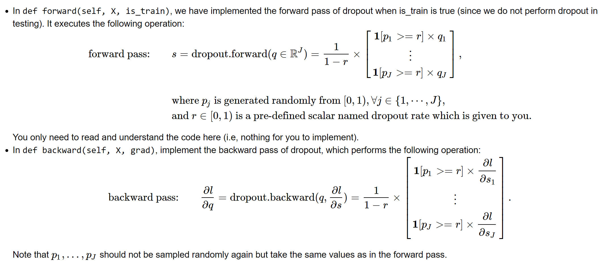
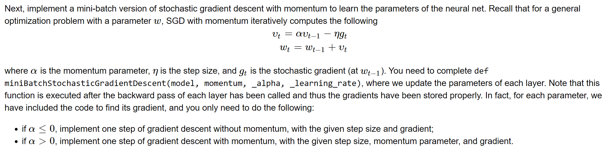
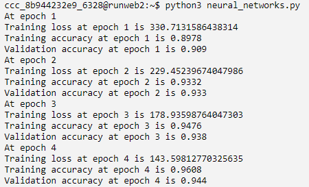

Neural Nets
======================================================

General instructions
----------------------------------------------------

-   In this task you will implement **neural nets**.

Neural Networks
--------------------------------------------------------------

### Q1. Linear Layer

First, you need to implement the linear layer of an MLP by implementing
3 python functions in `class linear_layer`. This layer has two
parameters W and b.

-   In the function `def __init__(self, input_D, output_D)`, you need to
    randomly initialize the entries of W and b with mean 0 and
    standard deviation 0.1 using np.random.normal. You also need to
    initialize the gradients to zeroes in the same function.

-   In `def forward(self, X)`, implement the forward pass of this layer.
    Note that the input \$X\$ contains several examples, each of which
    needs to be passed through this layer. Try to use matrix operation
    instead of for loops to speed up the code.

-   In `def backward(self, X, grad)`, implement the backward pass of
    this layer. Here, grad is the gradient with respect to the output of
    this layer, and you need to find and store the gradients with
    respect to W and b, and also find and return the gradients
    with respect to the input X of this layer.

### Q2. Activation function - RELU

Next, you need to implement the RELU activation by implementing 2 python
functions in `class relu`. There are no parameters to be learned in this
module.

-   In `def forward(self, X)`, implement the forward pass of RELU
    activation.
-   In `def backward(self, X, grad)`, implement the backward pass of
    RELU activation. Here, grad is the gradient with respect to the
    output of this layer, and you need to return the gradient with
    respect to the input X.

### Q3. Activation function - tanh

Next, you need to implement another activation function tanh, by
implementing 2 python functions in `class tanh`. There are no parameters
to be learned in this module.

-   In `def forward(self, X)`, implement the forward pass of tanh
    activation.
-   In `def backward(self, X, grad)`, implement the backward pass of
    tanh activation. Here, grad is the gradient with respect to the
    output of this layer, and you need to return the gradient with
    respect to the input X. See comments in the code for the formula of
    the derivative of tanh.

### Q4. Dropout

Dropout is one effective way to prevent overfitting. You will implement
one python function in `class dropout` to implement dropout.

### Q5. Mini-batch Stochastic Gradient Descent

### Q6. Connecting the dots

We connect all the parts in the function `main(main_params)`. Read the
code carefully and see how different parts are connected together. The
only thing you need to implement here is to call the backward pass of
each layer in the correct order and with the correct inputs.

### Q7. Testing your code

After completing all the above, you should be able to run
`neural_networks.py`, which tests your code on a subset of the MNIST
dataset for 10 epochs. If your implementation is correct, you should be
seeing something similar to the below (only showing the first 4 epochs;
it is okay if the numbers are slightly different). The training accuracy
and validation accuracy are also stored in a file called
`MLP_lr0.01_m0.0_d0.5_arelu.json`. 

**IMPORTANT:** before submitting this task for grading, you have to run
`runme.py`. This runs your code on the same MNIST dataset but with 4
different sets of hyperparameters, and produces four json files:

-   `MLP_lr0.01_m0.0_d0.0_arelu.json`
-   `MLP_lr0.01_m0.0_d0.0_atanh.json`
-   `MLP_lr0.01_m0.9_d0.25_atanh.json`
-   `MLP_lr0.01_m0.9_d0.5_arelu.json`

\
Then you have to **upload** these four json files to the **work**
directory (same as your `neural_networks.py` file). If you run
`runme.py` directly on the Vocareum\'s console, then these files are in
the **work** directory already. Once you confirm that you have these
files in addition to your modified `neural_networks.py` in this
directory, you can click submit for auto-grading.
